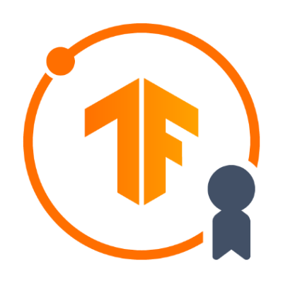

Welcome to ProblemCon++ 2.0  hackathon workshop.

Here we will take a look into Neural Network basics using Python programming language and TensorFlow framework developed by Google.

- In **Introduction** can be found overall information about AI, ML and NN.
- In **Part 1** can be found an end-to-end example/tutorial of regression classification problems.
- In **Part 2** we are going to build Computer Vision classifier with the power of Transfer Learning.
- In **Useful links** part I included links that can come to handy (and is good for inspiration).

If you have any questions, please let me know in [our Discord server,](https://discord.gg/sz4hKYVb) and I will gladly look into the problem.

Sincerely,

TensorFlow Developer,

ProblemCon++ organiser

V. Lohmanova

